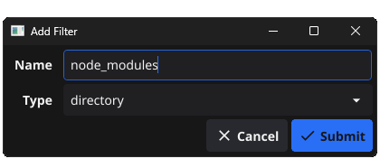
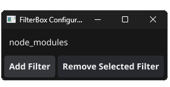

<div align="center">
  
  <h1>FilterBox - Go</h1>
</div>

<div align="center">
  <strong>Save that precious space and bandwidth</strong>
</div>
<div align="center">
  Automatically adds the <i>com.dropbox.ignored</i> xattr to filtered files & directories.
</div>

<div align="center">
  <sub>Built with ❤︎ by
  <a href="https://github.com/OlaHulleberg">Ola</a> and
  <a href="https://github.com/OlaHulleberg/filterbox/graphs/contributors">
    contributors
  </a>
</div>

## 🌟 Overview

FilterBox is a powerful tool designed to optimize Dropbox syncing across all platforms. By automatically applying the `com.dropbox.ignored` attribute to selected files and directories, it ensures efficient syncing by focusing on essential data only.
This is a cross-platform "remix" inspired by [Techial's FilterBox](https://github.com/Techial/FilterBox), now written in Go.

## ✨ Key Features

- **Resource-Efficient**: Runs with minimal system impact, utilizing an event-driven approach for file monitoring.
- **Adaptive Configuration**: Implements changes to filter settings in real-time, keeping your syncing preferences up-to-date.
- **Cross-Platform Support**: Compatible with Windows, Linux, and macOS, offering a smooth experience on any platform.
- **Minimalistic Configurator**: A straightforward, no-nonsense configurator. Cross-platform, of course.




## 🔧 Building and Installation

### Prerequisites

- **Golang**: Ensure Golang is installed on your system.
- **Fyne**: Required for UI components if you plan to modify the UI.
- **C Compiler**: GCC or any Golang-supported C compiler, to compile the UI.

### Building from Source

1. **Clone the Repository:**

   ```bash
   git clone https://github.com/OlaHulleberg/filterbox.git
   cd FilterBox
   ```

2. **Build the Application:**
   If you need to only build one of them, have a look at Makefile to see what commands it runs.
   ```bash
   make all
   ```

#### Install from Source **(Linux & Mac)**

3. **Install:**
   ```bash
   make install
   ```
   This step sets up the FilterBox daemon and UI on your Unix system, for the current user.

#### Install from Source **(Windows)**

3. **Install:**
   Double click `install_filterbox.bat`.
   The script requires Administrator rights, but will relaunch with them by itself. If not, simply `Run as Administrator`
   This step sets up the FilterBox daemon and UI on your Windows system, for the current user.

### Configuration

- **Run FilterBox**: Access the UI to configure your filters.
- **Define Filters**: Set the files and directories for Dropbox to ignore, using the `filterbox` command to open the UI. The filters config can also be accessed at `$HOME/.local/share/filterbox/filters.json`.

## 🌐 Cross-Platform Compatibility

FilterBox is tested on Linux and designed for compatibility across major operating systems.

## 📖 Intelligent Filtering

Customize your Dropbox experience. Exclude non-essential, large folders like `node_modules`, or other file types you prefer not to sync.

## 📥 Community and Contributions

Embrace a smarter Dropbox experience with FilterBox. Explore the [source code](https://github.com/OlaHulleberg/filterbox) and contribute to its development. Your involvement is key to enhancing FilterBox's capabilities!

---

**FilterBox**: Refining your Dropbox syncing process, intelligently and effectively. 🚀🌟

---
